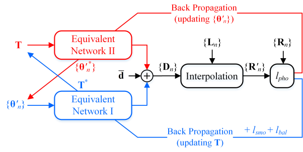
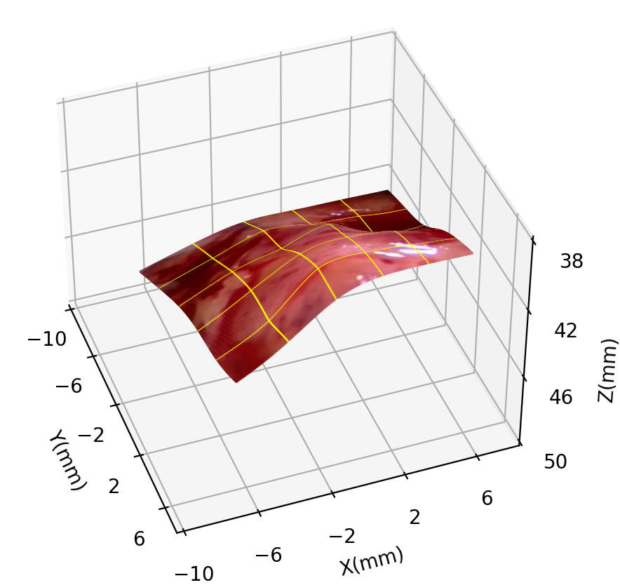
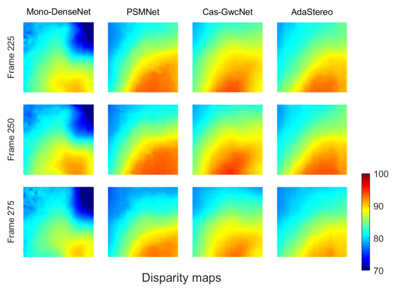
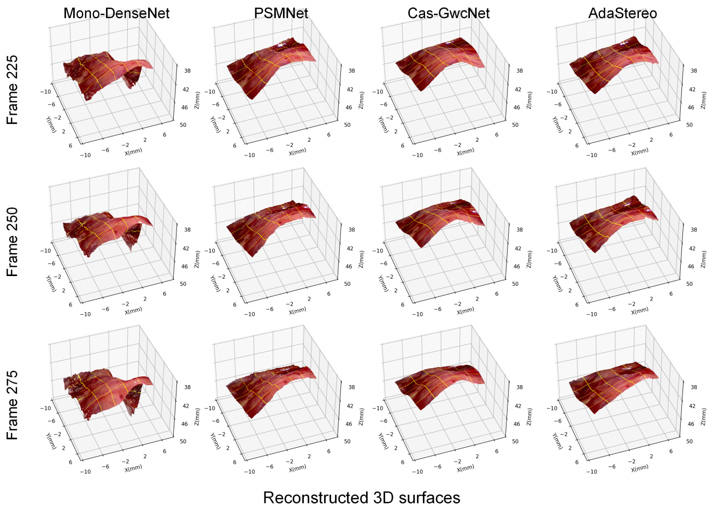

# Reconstructing-Dynamic-Soft-Tissue-with-Stereo-Endoscope-Based-on-a-Single-layer-Network

This is the official implementation for training and testing tpsNet model OTPS using the method described in 
>
> **Reconstructing-Dynamic-Soft-Tissue-with-Stereo-Endoscope-Based-on-a-Single-layer-Network**
>
> Bo Yang, Siyuan Xu et al.

#### Overview

<p align="center">
 
</p>

## ✏️ 📄 Citation

If you find our work useful in your research please consider citing our paper:

```
@inproceedings{ ,
  title={Reconstructing-Dynamic-Soft-Tissue-with-Stereo-Endoscope-Based-on-a-Single-layer-Network},
  author={Bo Yang, Siyuan Xu},
  journal={},
  volume={},
  pages={},
  year={2022},
  publisher={}
}
```

## ⚙️ Setup

We run our experiments with TensorFlow 1.14.0, CUDA 9.2, Python 3.6.12 and Ubuntu 18.04.

## 💾 Datasets

We provide first 300 frame stereo images. You can download the [EndoSLAM dataset](https://data.mendeley.com/datasets/cd2rtzm23r/1) and the [Hamlyn dataset](http://hamlyn.doc.ic.ac.uk/vision/) for more dataset test.

**preprocess**

We rectified stereo images sampled from the in-vivo endoscopy stereo video.

**split**

We train first 200 frame data of in-vivo endoscopy stereo dataset and test frame 201 to 300.

## ⏳ In vivo training

**Standard TPS training:**

```shell
CUDA_VISIBLE_DEVICES=0 python std_tps.py --model 'TPS' --cpts_row 4 --cpts_col 4 --output_directory <path_to_save_result>
```

**Alternative TPS training:**


Training step:
```shell
CUDA_VISIBLE_DEVICES=0 python o_tps.py --pretrained False --cpts_row 4 --cpts_col 4 --output_directory <path_to_save_result>
```
Test step:
```shell
CUDA_VISIBLE_DEVICES=0 python std_tps.py --model 'OTPS'
```
set `--model OTPS` to load trained T of OTPS model for test

We provide a `main.ipynb` include scripts above all.


## 3D Reconstruction

we ignore 3d plot code and show result directly. You can find a test reconstruction video in folder `result`.
<p align="center">
 
</p>

## Campare

we compare our method with several well-know end to end models of stereo depth estimation.

- disparity map result

<p align="center">
 
</p>

- reconstruction result

<p align="center">
 
</p>

## Contact

If you have any questions, please feel free to contact boyang@uestc.edu.cn.
